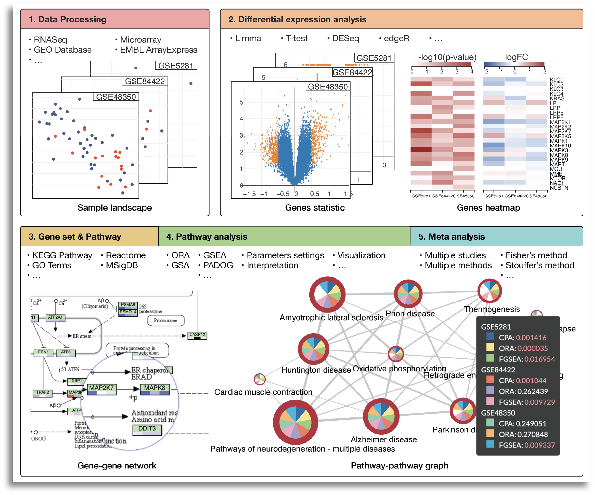

# Consensus Pathway Analysis (CPA) using Google Cloud Infrastructure

## <a name="overview">Overview</a>

This cloud-based learning module is specialized for pathway analyses using omics datasets to discover consistent biological mechanism behind a condition. The content will be arranged in five sub-modules which allows us to: 

1. Download and process data from public repositories
2. Perform differential analysis
3. Perform pathway analysis using different methods that seek to answer different research hypotheses
4. Perform meta-analysis and combine methods and datasets to find consensus results
5. Interactively explore significantly impacted pathways across multiple analyses, and browsing relationships between pathways and genes.

Each learning sub-moudule will be organized in a R 'Jupyter notebook' to help the participants familiarize themselves with the cloud computing in the specific context of running bioinformatics workflows. Each notebook will include step-by-step hand-one practice with R command line to obtain data, install necessary tools, perform analysis, visulize and intepret the results.

## Table of Contents

<a href="#prerequisites">prerequisites</a> 
<a href="#getting-started">Getting Started</a> 
<a href="#workflow">Workflows</a> 
<a href="#data">Data</a> 
<a href="#funding">Funding</a> 
 

## <a name="requirements">Pre</a>

These tutorials were designed to be used on cloud computing platforms, with the aim of requiring nothing but the files within this github repository.

With this in mind, our tutorials use Jupyter Notebook files, which Google Cloud Platform, Amazon Web Service, and Microsoft Azure all provide support for. Therefore, requirements should only require creation of a virtual machine on one of these providers, and the downloading of this github's files to that machine.

For more information on creating a virtual machine and downloading our github to that machine, we have a getting started section below. Currently this section only includes information on how to do this using Google Cloud Platform.

## <a name="getting-started">Getting Started</a>

This repository contains several notebook files which serve as bioinformatics workflow tutorials.

The below steps guide you through setting up a virtual machine on Google Cloud Platform, downloading our tutorial files, and running those files. 

Accordingly, before starting, make sure you have a google account and have access to a Google Cloud Platform Project.

Once you have these, you can begin by first navigating to https://console.cloud.google.com/ and logging in with your credentials. Then, in the top left of the screen, navigate to 'select a project', and choose the project you belong to.

### Navigating to the Vertex AI Workbench

Once a project has been selected, we can navigate to the Vertex AI Workbench, this is where we can make our virtual machine. 
To get there, select the navigation menu, and navigate to 'Vertex AI' under the Artificial Intelligence section. 
Within the Vertex AI submenu, select 'Workbench'.

[comment]: <>

### Creating a Virtual Machine

Within the Workbench screen, Select the option to create a 'New Notebook'.

Our notebooks include a notebook that uses R code, so check the 'R' framework. This will include Python as well as R compatibility. You can then choose a name for your virutal machine, you can name it whatever you like, and preferably choose a server location closest to you. Ignore the advanced options for now, and a default virtual machine will be created. A default machine has 4 vCPUS and 15GB RAM.

Creating a machine may take a few minutes to finish.

[comment]: <>

### Starting Your Virtual Machine

To start your virtual machine by clicking 'Open Jupyerlab'. You will know it is running because of the green checkmark.

Note, when you are finished running code, you should turn off your virtual machine to prevent unneeded billing or resource use by checking your notebook and pushing the 'Stop' button. 

[comment]: <>

### Downloading Tutorial Files

Now that you have created your virtual machine, and are in the Jupyterlab screen, you can run our tutorial files. But first you will need to download them.
The easiest way to do this would probably be to clone our repository directly. This can be done by using the 'Git' menu in Jupyterlab, and selecting the clone option. 
Next you can type in the link of repository: "https://github.com/King-Laboratory/rnaseq-myco-notebook.git" (without quotation marks) and click 'Clone'. 

This should download our repo, and the tutorial files inside, into a folder called 'rnaseq-myco-notebook'. Double click this folder now. Inside you will find all our tutorial files, which you can double click and run.

[comment]: <>

### Running Tutorial Files

All our tutorial workflows are are Jupyter format. To run them you need only to double click the tutorial file you want.

This will open the Jupyter file in Jupyter notebook. From here you can run each section, or 'cell', of the code, one by one, by pushing the 'Play' button on the above menu. 

Some 'cells' of code take longer for the computer to process than others. You will know a cell is running when a cell has an asterisk next to it \[\*\]. When the cell finishes running, that asterisk will be replaced with a number which represents the order that cell was run in.

You can now explore the tutorials by running the code in each, from top to bottom. Look at the 'workflows' section below for a short description of each tutorial.

Jupyter is a powerful tool, with many useful features. For more information on how to use Jupyter, we recommend searching for Jupyter tutorials and literature online.

[comment]: <>

### Stopping Your Virtual Machine

When you are finished running code, you can turn off your virtual machine to prevent unneeded billing or resource use by checking your notebook and pushing the 'Stop' button.

## <a name="workflow">Workflows</a>

Our tutorials are broken down into 'workflows'. Each notebook file covers a specific workflow, which contains written and visual commentary, as well as the actual step-by-step code for running that workflow analysis. 

These notebooks were designed to be run using a virtual machine on a cloud computing provider. For more information on how to do this; navigate to the <a href="#getting-started">'Getting Started'</a> section. Feel free to explore and run the workflows in any order you like. 

[comment]: <>

<strong><a href="Tutorial_1.ipynb">Workflow One</a>:</strong> A short introduction to downloading and mapping sequences to a transcriptome using Trimmomatic and Salmon. Here is a link to the YouTube video demonstrating the tutorial: <https://www.youtube.com/watch?v=NG1U7D4l31o&t=26s>.

<strong><a href="Tutorial_1B_Extended.ipynb">Extended Workflow One (Extended)</a>:</strong> An extended version of workflow one. Once you have got your feet wet, you can retry workflow one with this extended version that covers the entire dataset, and includes elaboration such as using SRA tools for sequence downloading, and examples of running batches of fastq files through the pipeline. This workflow may take around an hour to run.

<strong><a href="Tutorial_2_Snakemake.ipynb">Workflow One (Using Snakemake)</a>:</strong> Using snakemake to run workflow one.

<strong><a href="Tutorial_3_DEG_Analysis.ipynb">Workflow Two (DEG Analysis)</a>:</strong> Using Deseq2 and R to conduct clustering and differential gene expression analysis.

## <a name="data">Data</a>

These tutorials use example sequence data procured from the Sally Molloy labratory here at University of Maine; which investigates the transcriptome change in prophage infected, versus non-prophage infected <I>M. chelonae</I> bacteria. The respective article can be found <a href="https://www.ncbi.nlm.nih.gov/pmc/articles/PMC8191103/">here</a>.

## <a name="forum">Support Forum Thanks</a>

Support forum thanks. For almost any programming project, contributions to online databases and support forums are an invaluable resource that are heavily leaned upon. Thank goodness for those people who take the time to answer silly questions.

## <a name="funding">Funding</a>

Funded by the NV INBRE Program (GM103440, National Institute of General Medical Sciences).

